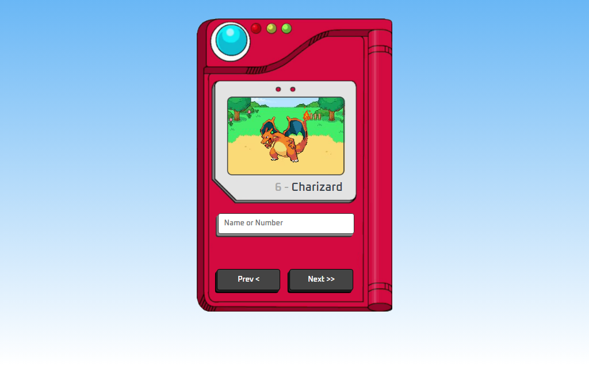

# Pokédex

> Pokédex

Nesse projeto criei uma pokédex buscando os dados de uma API.

[Clique para acessar](https://guimiiller.github.io/pokedex/)

## 🚀 Tecnologias

- HTML
- CSS
- JavaScript
- Git e Github

## 💻 O que aprendi

- Fazer requisições para buscar os dados dos pokemons
- Usar a função clamp

## 📨 Contato

- guilhermemillerblack@gmail.com